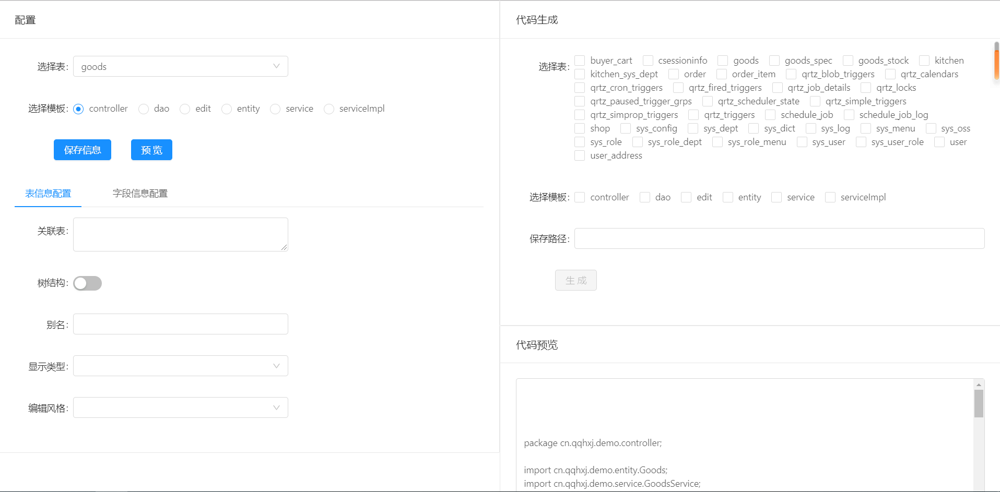

# fast-code

一个代码生成框架

## 如何使用

请参考 [fast-code-admin](fast-code-admin)
1. 引入`stater`
    ```xml
    <dependency>
        <artifactId>fast-code-starter-web</artifactId>
        <groupId>cn.qqhxj</groupId>
        <version>0.0.1-SNAPSHOT</version>
    </dependency>
    ```

2. 配置 `fast-code`
    ```yaml
    fast-code:
      configPath: config
    
    ```

3. 启动访问

    打开浏览器 [fast-code](http://localhost:8080/fastCode)
    
4. 模板设计
    请参考 [config](config)
5. 表配置

6. 代码生成

## `fast-code` 配置生成页面


## `docker` 运行
```shell script
docker run -d -v $configDir /fastCode/runtime/config -v $hostDir $dir  -p 10001:10001 han1396735592/fast-code:tag
```
